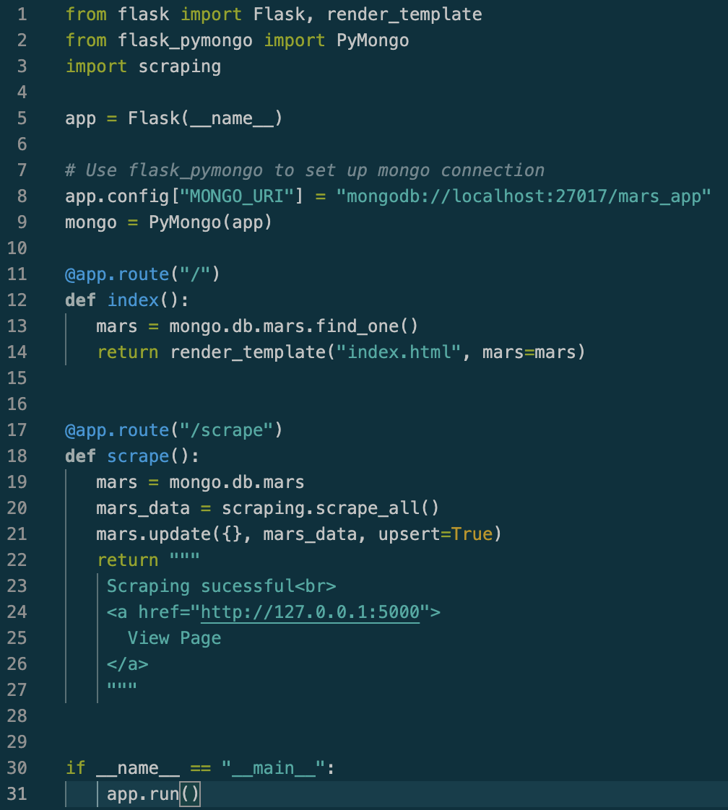
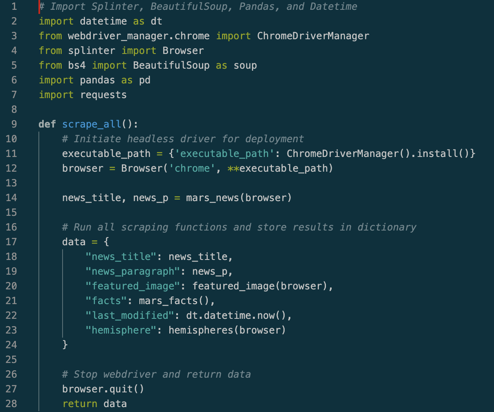

# MARS

## Details

This repo runs based on flask (app.py). When app.py runs it will pull in index.html as the template, and then new data can be scraped to the page.

## About

This repo is designed to specifically showcase my skills using flask and scaping data from webpages.

